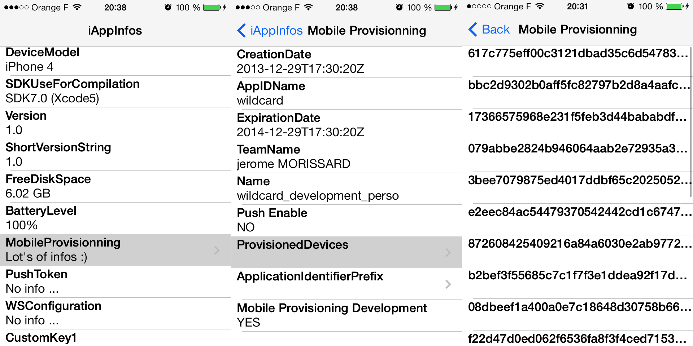

iAppInfos
=========

[](http://twitter.com/leverdeterre)
[](https://github.com/leverdeterre/iAppInfos/blob/master/LICENCE)
[](https://github.com/leverdeterre/iAppInfos)

iAppInfos allows a easy access to ALL important App informations.  



#Available informations
## Device infos
*   iOS version 
*   Device model
*   Device type
*   Device performace (Has good graphical performance?)
*   Free disk space 
*   Memory Use By the App
*   Free memory space
*   Battery level 
*   Operator name

## Apps infos
*   Targeted iOS version
*   App version number 
*   App short Version number
*   SDK use for compilation
*   Mobile provisionning push information (enable or not),
*   Mobile provisionning dev information (development / production),
*   Mobile provisionning UDID list (provisioned devices),

##Add custom values
*   WS Configuration
*   Token push

```objective-c
[[iAppInfos sharedInfo] addCustomValue:@"This is a custom value" 
                                          forCustomKey:@"CustomKey1"];
```

# Usage in the real life 

## Present all informations in a tableView (try the demo)
See the sample, a very classic TableView Controller (JMOViewController)

## Get informations one by one

```objective-c
//Using properties
[iAppInfos sharedInfo].targetedVersion
[iAppInfos sharedInfo].currentOSVersion
[iAppInfos sharedInfo].appVersion
[iAppInfos sharedInfo].shortAppVersion
[iAppInfos sharedInfo].freeMemorySpace
[iAppInfos sharedInfo].operatorName
[iAppInfos sharedInfo].deviceModelName
[iAppInfos sharedInfo].deviceModelType
[iAppInfos sharedInfo].devicePowerInfo
[[iAppInfos sharedInfor].devicePowerInfo hasGoodGraphicPerformance]
[iAppInfos sharedInfo].compilationSDK
[iAppInfos sharedInfo].freeDiskSpace
[iAppInfos sharedInfo].batteryLevel
[iAppInfos sharedInfo].mobileProvisionning
[[iAppInfos sharedInfo].mobileProvisionning provisionedDevices]
[[iAppInfos sharedInfo].mobileProvisionning pushConfiguration]

//Using dictionnary keys
[[iAppInfos sharedInfo] infoForKey:AppVersionManagerKeyYouriOSVersion];
```

##Defined keys are :
```objective-c
#define AppVersionManagerKeyTargetedVersion             @"targetedVersion"
#define AppVersionManagerKeyYouriOSVersion              @"currentOSVersion"
#define AppVersionManagerKeyCFBundleVersion             @"appVersion"
#define AppVersionManagerKeyCFBundleShortVersionString  @"shortAppVersion"
#define AppVersionManagerKeyFreeMemory                  @"freeMemorySpace"
#define AppVersionManagerKeyMemoryUseByApp              @"memoryUsedByApp"
#define AppVersionManagerKeyOperator                    @"operatorName"
#define AppVersionManagerKeyYourDeviceModel             @"deviceModelName"
#define AppVersionManagerKeyYourDeviceType              @"deviceModelType"
#define AppVersionManagerKeyGraphicalPerformance        @"devicePowerInfo"
#define AppVersionManagerKeyCompilationSDK              @"compilationSDK"
#define AppVersionManagerKeyFreeDiskSpace               @"freeDiskSpace"
#define AppVersionManagerKeyBatteryLevel                @"batteryLevel"
#define AppVersionManagerKeyMobileProvisionning         @"mobileProvisionning"
```
